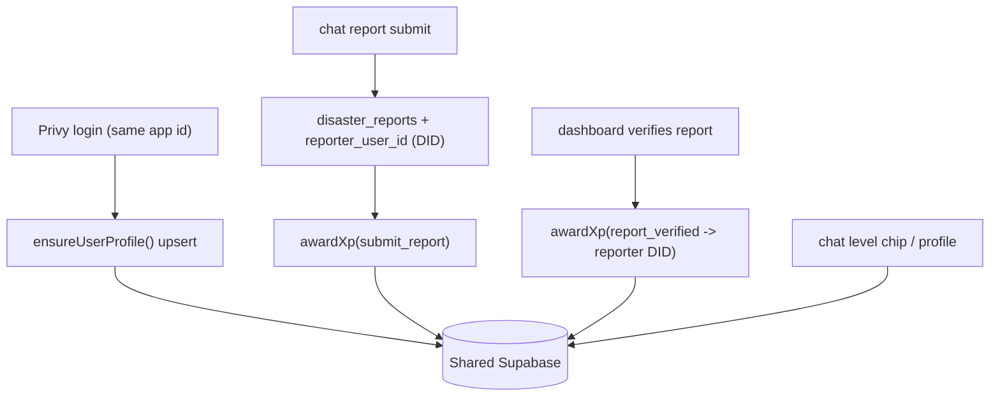

# AERIS CHAT — User Profile & XP Gamification Implementation Guide

This guide explains how to adopt the shared user profile + XP gamification system
in the **AERIS CHAT** project. The dashboard (AERIS Typhoon Terminal) already
shipped it; this document is the chat-side how-to.

> Canonical contract: `docs/USER_PROFILE_GAMIFICATION.md` in the dashboard repo.
> This file is the porting/integration guide for AERIS CHAT specifically.

## 0. Context

AERIS CHAT shares the **same Supabase project** (`bmmemsztajwfnzrnvyrs`) and the
**same Privy app** as the dashboard. Therefore:

- **No new database migrations are required** — the tables, functions, and views
  already exist and are live.
- The **same Privy DID** identifies a user in both products, so profile, proxy
  wallet, XP, and level persist across AERIS CHAT and the dashboard.
- AERIS CHAT only needs to **write to the existing schema** using the same
  conventions.



## 1. Prerequisites (env)

Set these in AERIS CHAT with the **same values** as the dashboard:

```
NEXT_PUBLIC_SUPABASE_URL=          # shared project
NEXT_PUBLIC_SUPABASE_ANON_KEY=
SUPABASE_SERVICE_ROLE_KEY=         # service role (server-only, never shipped to browser)
NEXT_PUBLIC_PRIVY_APP_ID=          # MUST be the same Privy app as the dashboard
PRIVY_APP_SECRET=                  # for server-side Privy user lookup (email + embedded wallet)
```

The shared `NEXT_PUBLIC_PRIVY_APP_ID` is what makes the same DID resolve in both
products. If this differs, profiles will NOT be shared.

## 2. What already exists in the database (do not re-create)

| Object | Purpose |
| --- | --- |
| `aeris_user_profiles` (PK `user_id TEXT`) | profile, proxy wallet, xp, level |
| `aeris_xp_events` | XP ledger + idempotency (`dedupe_key` unique when set) |
| `award_xp(p_user_id, p_action, p_points, p_dedupe_key, p_ref_id)` | atomic award RPC |
| `aeris_level_from_xp(p_xp)` | SQL level curve |
| `aeris_leaderboard` view | public-safe `username/level/xp` (granted to anon/authenticated) |
| `disaster_reports.reporter_user_id TEXT` | reporter's Privy DID |

The base tables are **service-role only** (they hold PII: email/phone/wallet), so
all profile/XP access from AERIS CHAT must run server-side with the service-role
key. Never read/write these from the browser anon client.

## 3. Port the shared libs

Copy these files from the dashboard repo into AERIS CHAT (they only depend on
Supabase REST + Privy, nothing dashboard-specific):

| Dashboard file | Role |
| --- | --- |
| `lib/supabase-rest.ts` | service-role REST config + headers |
| `lib/gamification.ts` | `XP_REWARDS`, `levelFromXp`, `levelProgress`, `awardXp()` |
| `lib/username.ts` | random username generator + validation |
| `lib/user-profiles.ts` | `getUserProfile`, `ensureUserProfile`, `updateUserProfile`, `toClientProfile` |
| `lib/privy-users.ts` | server-side Privy REST lookup (email + embedded wallet) |
| `lib/privy-config.ts` | `getPrivyAppId()` helper (or reuse chat's equivalent) |

`lib/privy-users.ts` depends on `getPrivyAppId()` from `lib/privy-config.ts`; if
AERIS CHAT already has a Privy config helper, point the import at it instead.

### Level curve (must match SQL exactly)

Cumulative XP to reach level `L` is `25 * L * (L + 1)`:

- Lv 1 = 50, Lv 2 = 150, Lv 10 = 2,750, Lv 50 = 63,750, Lv 99 = 247,500 (capped at 99).

If you change rewards or the curve, change BOTH `lib/gamification.ts` and the SQL
`aeris_level_from_xp` — never one without the other.

## 4. Profile sync on login

Add a server route mirroring the dashboard's `/api/user/sync`:

```ts
// app/api/user/sync (chat side) — pseudocode
const userId = await resolveSessionUserId();        // Privy DID, "did:privy:..."
if (!userId) return unauthorized();
const info = await fetchPrivyUserInfo(userId);      // authoritative email + embedded wallet
const profile = await ensureUserProfile({
  userId,
  email: info?.email ?? null,
  walletAddress: info?.walletAddress ?? null,       // embedded wallet = proxy wallet
});
return { profile: toClientProfile(profile) };
```

Trigger it:
1. From Privy `onComplete` after login (fire-and-forget), and
2. Once on app load (safety net) — the dashboard does this in a `ProfileProvider`
   client context. The embedded wallet may not exist on the very first sync, so
   the on-load sync backfills it later.

`ensureUserProfile` is idempotent: it creates a row with a random username on
first sight and backfills email/wallet on later logins.

## 5. Tag reports with the reporter DID (critical)

This is the single most important integration: it lets chat users earn XP when
their report is verified (by the dashboard operator).

On every `disaster_reports` insert from AERIS CHAT:

```ts
{
  source_app: "aeris-chat",            // keep this; the dashboard filters on it
  // ...existing report fields...
  reporter_user_id: reporterDid ?? null, // Privy DID; null for anonymous reports
}
```

- Use `reporter_user_id` (TEXT). Do **not** use the legacy `user_id` column for
  the DID — that column is `UUID` and cannot store `did:privy:...`.

## 6. Award XP at the right moments

Use the ported `awardXp()` helper (server-side) with **stable dedupe keys** so the
same action is never double-rewarded across products:

| Event (chat side) | Call | dedupe_key |
| --- | --- | --- |
| Signed-in user submits a report | `awardXp(did, "submit_report", { refId: reportId, dedupeKey: \`submit_report:${reportId}\` })` | `submit_report:{reportId}` |
| Usage time (optional heartbeat) | `awardXp(did, "usage_time", { dedupeKey: \`usage:${did}:${bucket}\` })` | `usage:{did}:{15-min bucket}` |
| Profile completed (optional) | `awardXp(did, "profile_completed", { dedupeKey: \`profile_completed:${did}\` })` | `profile_completed:{did}` |

You do **not** award `report_verified` from chat — the dashboard already awards it
to the reporter's DID on operator verify, using `report_verified:{reportId}`.
Because dedupe keys are shared, it fires exactly once regardless of product.

`awardXp` returns `{ xp, level, leveledUp, awarded }`. `awarded === false` means a
duplicate (dedupe hit) or the profile row didn't exist yet (so always sync first).

## 7. Reading & displaying profile / level

- Server: a `GET` route mirroring `/api/user/profile` returning
  `toClientProfile(row)`.
- Client: render the XP bar with the ported `levelProgress(xp)` so the curve
  matches the dashboard exactly.
- Leaderboard (optional): the `aeris_leaderboard` view can be read with the anon
  key — it exposes only `username/level/xp`.

## 8. Editing profile (optional)

If AERIS CHAT exposes a profile editor, mirror the dashboard `PATCH /api/user/profile`:

- `username`: 3–24 chars, pattern `^[A-Za-z0-9_\-.[\]]+$`, case-insensitive unique
  (409 on collision).
- `barangay`, `phone` (pattern `^[+0-9 ()-]{6,20}$`), `avatar_url` (safe URL).
- `socials`: allowed keys `twitter, facebook, instagram, telegram, discord, website`
  (`website` must be a valid URL).

## 9. Test checklist

1. Log into AERIS CHAT with a Privy account that has also used the dashboard →
   same `aeris_user_profiles` row, same XP/level.
2. Submit a report in chat → `disaster_reports.reporter_user_id` = your DID and a
   single `submit_report` XP event is recorded.
3. Verify that report from the dashboard → reporter receives `report_verified`
   (40 XP); re-verifying does not double-award.
4. Level/XP shown in chat matches the dashboard.

## 10. Gotchas

- **Same Privy app id** in both repos is mandatory, or DIDs won't match.
- **Never** expose `SUPABASE_SERVICE_ROLE_KEY` to the browser; all awards and
  profile writes are server-side.
- Always run sync before awarding — `award_xp` no-ops if the profile row is
  missing.
- The embedded ("proxy") wallet can be absent on first sync; re-sync on app load
  backfills it.
- Keep `lib/gamification.ts` aligned with the SQL curve at all times.

## Appendix — XP rewards (defaults)

From `lib/gamification.ts` (`XP_REWARDS`):

| Action | Points |
| --- | --- |
| `submit_report` | 15 |
| `report_verified` | 40 |
| `review_report` | 10 |
| `usage_time` | 5 |
| `profile_completed` | 25 |
